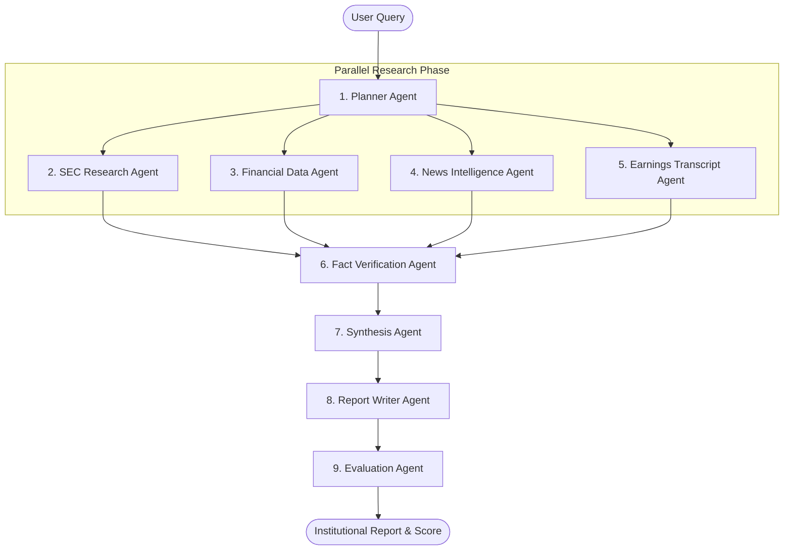

# ARA-1: Autonomous Financial Research Agent

[](https://www.python.org/)
[](LICENSE)
[](https://github.com/langchain-ai/langgraph)
[](https://qdrant.tech/)
[](https://prometheus.io/)

ARA-1 is a production-ready, enterprise-grade autonomous AI system designed to emulate the complete workflow of a junior financial analyst. From initial query intake and SEC filings ingestion to complex quantitative calculations and institutional-quality investment report generation, ARA-1 automates high-fidelity financial research.

---

## Table of Contents

- [System Architecture](#system-architecture)
- [Key Features](#key-features)
- [Technology Stack](#technology-stack)
- [Memory System](#memory-system)
- [Conflict Resolution & Hierarchy](#conflict-resolution--hierarchy)
- [Directory Structure](#directory-structure)
- [Quick Start](#quick-start)
  - [Prerequisites](#prerequisites)
  - [Installation & Configuration](#installation--configuration)
  - [Docker deployment](#docker-deployment)
- [Agents & Tools Registry](#agents--tools-registry)
  - [Autonomous Agents](#autonomous-agents)
  - [Analytical Tools](#analytical-tools)
- [Evaluation & Benchmarks](#evaluation--benchmarks)
- [API Reference](#api-reference)
- [Production Reliability & Resilience](#production-reliability--resilience)
- [License](#license)

---

## System Architecture

ARA-1 uses a multi-agent orchestration architecture built on **LangGraph**. The workflow progresses from planning to concurrent research, followed by fact-checking, synthesis, report writing, and quantitative evaluation.



---

## Key Features

- **Multi-Agent Orchestration**: LangGraph-based workflow coordinates 9 specialized agents running task-specific execution graphs.
- **RAG & Hybrid Search**: 7-stage retrieval pipeline utilizing HyDE query expansion, dense embeddings (`text-embedding-3-large`), and Cross-Encoder reranking.
- **Conflict Resolution Engine**: A 5-tier authoritative data hierarchy to resolve discrepancies between SEC filings, market APIs, transcripts, and news.
- **Fact Verification**: Numerical and qualitative claims are cross-referenced with primary data sources and scored for factual confidence.
- **Institutional Reports**: Generates structured 14-section investment research reports complete with source citations, valuations, and risk matrices.
- **Comprehensive Evaluation**: Automated assessment across 25+ metrics (accuracy, completeness, logical coherence) and 8 predefined benchmark challenges.

---

## Technology Stack

| Layer | Technology | Description |
| :--- | :--- | :--- |
| **Agent Orchestration** | LangGraph | StateGraph-based stateful multi-agent workflows |
| **Language Models** | OpenAI GPT-4o | Primary engine for planning, synthesis, and writing |
| **Embeddings** | OpenAI text-embedding-3-large | 3072-dimension semantic vectors |
| **Backend API** | FastAPI + WebSockets | High-performance asynchronous API endpoints |
| **Short-Term Memory** | Redis | Session state, run-time message caching, and locked states |
| **Long-Term Memory** | Qdrant Vector DB | Semantic storage of document chunks and web data |
| **Episodic Memory** | PostgreSQL (SQLAlchemy) | Historical audit logs, trajectories, and generated reports |
| **Financial Feeds** | Yahoo Finance, Alpha Vantage | Stock pricing, historical indicators, peer ratios |
| **SEC Ingestion** | SEC EDGAR API | 10-K, 10-Q filing retrieval and parsing |
| **Containers** | Docker + Docker Compose | Standardized microservices deployment |
| **Telemetry & Metrics**| Prometheus + Grafana | System latency, API usage, error rates, and cost tracking |

---

## Memory System

```
Short-Term  --->  Redis       (Session state, tool outputs, active graph states)
Long-Term   --->  Qdrant      (Chunked filings, news articles, transcript segments)
Episodic    --->  PostgreSQL  (Execution histories, full agent steps, final outputs)
```

1. **Short-Term**: Holds transient state between agent steps, ensuring data continuity inside the LangGraph workflow.
2. **Long-Term**: Stores raw and processed external data using semantic embeddings, allowing agents to retrieve historical context.
3. **Episodic**: Tracks the historical trajectory of queries, intermediate agent decisions, tool calls, and final performance metrics for audit and refinement.

---

## Conflict Resolution & Hierarchy

To handle conflicting data points (e.g., mismatched revenue numbers between a news article and an SEC filing), ARA-1 implements a strict **5-tier data hierarchy**:

```
[Tier 1] SEC Filings (EDGAR)             <-- Most Authoritative
  └── [Tier 2] Financial APIs (yfinance)
        └── [Tier 3] Earnings Transcripts
              └── [Tier 4] Major News Outlets
                    └── [Tier 5] General Web Search  <-- Least Authoritative
```

When a conflict is detected during the synthesis phase, the engine automatically resolves it by:
1. Prioritizing the higher-tier source.
2. Checking document timestamps (preferring the most recent data within the same tier).
3. Computing source confidence scores based on past factual verification rates.
4. Logging the resolution rationale in the final report's *Research Methodology* section.

---

## Directory Structure

```
Autonomous Financial Research Agent/
├── backend/
│   ├── agents/         # 9 LangGraph agents (SEC, Financial, News, etc.)
│   ├── tools/          # 15 OpenAI function-calling tools (SEC search, peer comparison, etc.)
│   ├── graph/          # LangGraph state machine & workflow graphs
│   ├── memory/         # Database adapters (Redis, Qdrant, PostgreSQL)
│   ├── rag/            # 7-stage retrieval, compression, and Reranking pipeline
│   ├── conflict/       # 5-tier conflict resolution engine
│   ├── evaluation/     # 25+ metrics suite and 8 benchmark challenge definitions
│   ├── api/            # FastAPI routers, WebSocket handlers, and models
│   ├── db/             # SQLAlchemy ORM schemas and Alembic database migrations
│   └── core/           # Configuration management, custom loggers, and retry policies
├── frontend/           # Vanilla JS Single Page Application with Dark Mode Dashboard
├── docker/             # Dockerfiles, Nginx configurations, and Prometheus scrape rules
├── docker-compose.yml  # Multi-container orchestration specification
├── pyproject.toml      # Dependency specifications and code quality tools (Black/Ruff)
├── requirements.txt    # Frozen pip dependencies
├── alembic.ini         # Database migration configuration
├── .env.example        # Environment variables template
└── .github/            # GitHub Actions CI/CD workflows
```

---

## Quick Start

### Prerequisites

- Python 3.11 or higher installed locally (if running without Docker)
- Docker & Docker Compose
- OpenAI API Key

### Installation & Configuration

1. **Clone the Repository**:
   ```bash
   git clone https://github.com/mradulg2122-prog/Autonomous_Financial_Research_agent.git
   cd Autonomous_Financial_Research_agent
   ```

2. **Configure Environment Variables**:
   Copy the template and fill in your keys:
   ```bash
   cp .env.example .env
   ```
   *Note: Open `.env` and fill in `OPENAI_API_KEY`. Add Alpha Vantage, NewsAPI, and SEC keys for extended coverage.*

### Docker Deployment

Launch the entire suite (API, Frontend, Vector DB, PostgreSQL, Redis, and Monitoring) using Docker Compose:

```bash
docker-compose up -d --build
```

#### Available Service Endpoints:
- **Frontend Dashboard**: http://localhost:3000
- **FastAPI backend Docs**: http://localhost:8000/docs
- **Qdrant DB UI**: http://localhost:6333/dashboard
- **Grafana Dashboards**: http://localhost:3001 (Default credentials: `admin` / `admin`)
- **Prometheus Metrics**: http://localhost:9090

---

## Agents & Tools Registry

### Autonomous Agents

| Agent Name | Operational Role | Key Responsibilities |
| :--- | :--- | :--- |
| **Planner Agent** | Orchestration & Routing | Analyzes queries, breaks tasks into subtasks, and assigns targets. |
| **SEC Research Agent** | Filings Analyst | Fetches 10-K/10-Q forms, extracts MD&A, and pulls Risk Factors. |
| **Financial Data Agent** | Quantitative Analyst | Retrieves balance sheets, cash flows, and calculates key ratios. |
| **News Intelligence Agent** | Market Sentiment | Monitors real-time news feeds, blogs, and assigns sentiment weights. |
| **Earnings Transcript Agent** | Management Analyst | Parses earnings transcripts, Q&A blocks, and executive guidance. |
| **Fact Verification Agent** | Auditing & Compliance | Cross-references numerical metrics and outputs confidence metrics. |
| **Synthesis Agent** | Merging & Comparison | Resolves dataset overlaps, handles conflicts, and performs peer reviews. |
| **Report Writer Agent** | Synthesis & Compilation | Assembles reports into a standard 14-section layout with citations. |
| **Evaluation Agent** | Quality Control | Scores the final output on 25+ metrics across 11 distinct dimensions. |

### Analytical Tools

All tools are built to support OpenAI's tool-calling specifications.

| Tool Identifier | Source Provider | Functional Purpose |
| :--- | :--- | :--- |
| `sec_filing_search` | SEC EDGAR | Performs keyword and section searches on financial reports. |
| `financial_data_api` | Yahoo Finance / AlphaVantage | Extracts income statements, balance sheets, and key ratios. |
| `calculation_engine` | Internal Math Module | Validates math operations and computes financial formulas. |
| `market_data_tool` | Yahoo Finance | Fetches historical price bars, volumes, and moving averages. |
| `company_profile` | Yahoo Finance | Retrieves metadata, sector details, and executive team listing. |
| `earnings_transcript` | SEC / Web Scraper | Extracts earnings call transcripts and Q&A sessions. |
| `news_search` | NewsAPI / DuckDuckGo | Searches historical and current news articles. |
| `web_search` | DuckDuckGo | Performs general fallback queries for web research. |
| `sentiment_analysis` | OpenAI GPT-4o | Performs entity-level sentiment scoring on texts. |
| `peer_comparison` | Yahoo Finance | Extracts profiles and metrics of competitors. |
| `vector_db_search` | Qdrant | Searches long-term memory collections for relevant chunks. |
| `vector_db_store` | Qdrant | Embeds and stores findings in long-term memory collections. |
| `fact_checker` | OpenAI GPT-4o | Audits text statements against numeric evidence lists. |
| `report_generator` | OpenAI GPT-4o | Drafts sections conforming to institutional writing style guidelines. |
| `risk_analysis_tool` | OpenAI GPT-4o | Processes risk vectors and assigns impact/probability levels. |

---

## Evaluation & Benchmarks

The system incorporates an automated testing and evaluation suite that scores runs on a scale from `0.0` to `1.0` across 11 categories (e.g., Factual Accuracy, Completeness, Reasoning Quality, Memory Utilization, Source Diversity).

We test against **8 Standard Benchmark Challenges**:

1. **Company Profile (AAPL)**: Basic information extraction (Min Score: `0.70`).
2. **Financial Summary (MSFT)**: Balance sheet & cash flow consolidation (Min Score: `0.75`).
3. **Risk Assessment (TSLA)**: Extraction of key operational risks (Min Score: `0.70`).
4. **Peer Comparison (GOOGL)**: Multi-company financial comparison (Min Score: `0.70`).
5. **Earnings Analysis (AMZN)**: Q&A sentiment and guidance summary (Min Score: `0.65`).
6. **Industry Research (NVDA)**: Market size and competitor analysis (Min Score: `0.70`).
7. **Investment Thesis (JPM)**: Justification of Buy/Sell recommendations (Min Score: `0.75`).
8. **Full Institutional Report (NVDA)**: Complete 14-section comprehensive document (Min Score: `0.80`).

To run the benchmarking suite locally:
```bash
python -c "import asyncio; from backend.evaluation.benchmarks import run_benchmark, BENCHMARK_CHALLENGES; asyncio.run(run_benchmark(BENCHMARK_CHALLENGES[0]))"
```

---

## API Reference

### Core Endpoints

| Method | Endpoint | Description |
| :--- | :--- | :--- |
| `POST` | `/api/v1/research` | Starts a new research session for a given company. |
| `GET` | `/api/v1/research` | Retrieves list of all research sessions. |
| `GET` | `/api/v1/research/{id}` | Gets active status/progress of a research run. |
| `WS` | `/api/v1/research/ws/{id}` | Connects to a real-time event stream of agent executions. |
| `GET` | `/api/v1/reports/{id}` | Returns the structured research report. |
| `GET` | `/api/v1/reports/{id}/markdown` | Exports the research report as raw Markdown. |
| `GET` | `/api/v1/evaluation/{id}` | Fetches evaluation metrics and scoring details. |
| `POST` | `/api/v1/evaluation/benchmarks/run` | Triggers a full run of the benchmark challenges. |

---

## Production Reliability & Resilience

- **Exponential Backoff**: Integrates `tenacity` retries with random jitter to gracefully handle external rate limits (429s).
- **Circuit Breakers**: Individual tools and APIs fail fast if services are down, preventing execution blocks.
- **Failover Chains**: Automatically falls back to DuckDuckGo/general web search if specialized financial APIs fail.
- **State Persistence**: Memory states are backed up dynamically in Redis, allowing crash recovery and state resumption.
- **Docker Health Checks**: Containers are monitored via built-in health endpoints, allowing auto-restart on failures.

---

## License

This project is licensed under the MIT License - see the [LICENSE](LICENSE) file for details.
